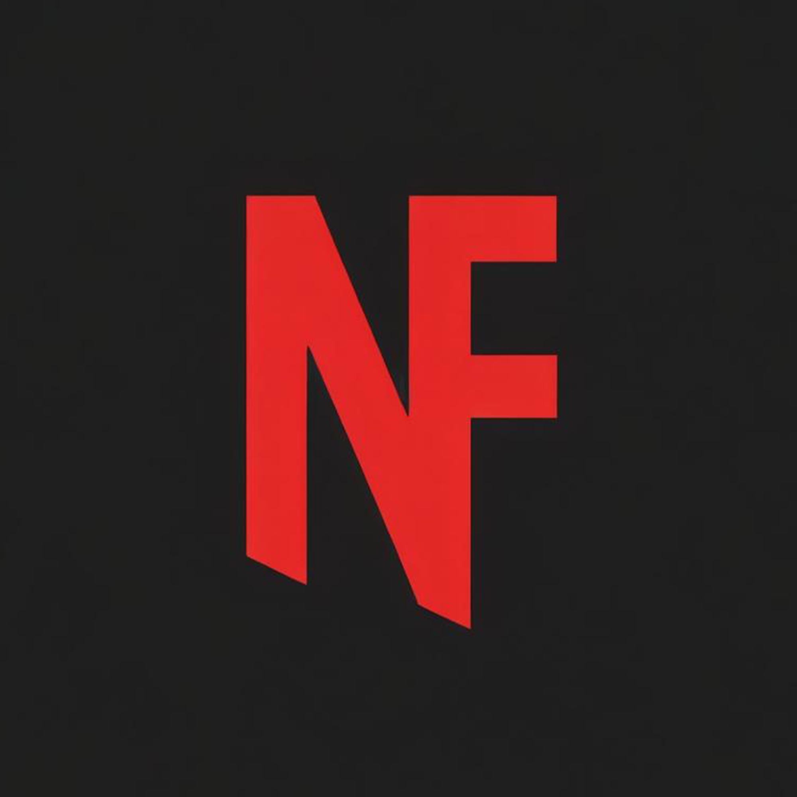

<div align="center">

<h1>NetFlex</h1>

A Netflix-style streaming web app with modern design, authentication, and social features.

</div>

## 🌟 Features

### Core Features
- **Netflix-style Interface** - Modern, sleek design inspired by Netflix
- **Responsive Design** - Works perfectly on all devices
- **Movies & TV Shows** - Browse popular and trending content
- **Search Functionality** - Find your favorite movies and shows
- **Dark Mode** - Netflix-style dark theme
- **PWA Support** - Progressive Web App capabilities
- **Fast & Lightweight** - Built with Next.js for optimal performance

### 🔐 Authentication & User Management
- **User Registration/Login System** - Secure local authentication
- **Multiple User Profiles** - Family-friendly profile system like Netflix
- **Profile Management** - Create, edit, and switch between profiles
- **Kids Profiles** - Special profiles with age-appropriate content filtering
- **Demo Accounts** - Pre-configured demo accounts for testing

### 👥 Social Features
- **Ratings System** - Rate movies and shows with 5-star system
- **Reviews & Comments** - Write detailed reviews and read community feedback
- **Invitation Links** - Share your favorite content with friends via invitation codes
- **Community Ratings** - See average ratings from all users
- **Like/Dislike Reviews** - Engage with community reviews

### 🗄️ Data Management
- **Local JSON Database** - No external server required
- **User Data Storage** - Profiles, ratings, and reviews stored locally
- **Invitation System** - Shareable links with expiration and usage limits
- **Profile Preferences** - Customizable settings per profile

## 🚀 Quick Start

### Demo Accounts
The app comes with pre-configured demo accounts:

**Admin Account:**
- Email: `admin@netflex.com`
- Password: `admin123`
- Profiles: Admin (All content), Kids (G-rated content)

**Demo Account:**
- Email: `demo@netflex.com`
- Password: `demo123`
- Profile: Demo User (PG-13 content)

### Installation

1. **Clone the repository**

   ```bash
   git clone https://github.com/ch1kim0n1/NetFlex.git
   cd NetFlex
   ```

2. **Install dependencies**

   ```bash
   npm install
   # or
   yarn install
   ```

3. **Run the development server**

   ```bash
   npm run dev
   # or
   yarn dev
   ```

4. **Open your browser**
   Navigate to `http://localhost:3000` to see the application

## 📦 Build

To build the application for production:

```bash
npm run build
# or
yarn build
```

## 🔧 Configuration

Create a `.env.local` file in the root directory and add your API keys:

```env
NEXT_PUBLIC_TMDB_API_KEY=your_tmdb_api_key
NEXT_PUBLIC_GA_TRACKING_ID=your_google_analytics_id
NEXT_PUBLIC_TAWKTO_PROPERTY_ID=your_tawkto_property_id
NEXT_PUBLIC_TAWKTO_WIDGET_ID=your_tawkto_widget_id
```

## 🗂️ Database Structure

The app uses local JSON files stored in the `database/` folder:

- **users.json** - User accounts and credentials
- **profiles.json** - User profiles with preferences
- **ratings.json** - User ratings for movies/shows
- **reviews.json** - User reviews and comments
- **invitations.json** - Invitation links and sharing data

## 📱 Usage Guide

### Authentication
1. Click "Sign In" in the header
2. Use demo credentials or create an account
3. Select a profile after login
4. Switch profiles anytime via user menu

### Rating & Reviewing
1. Navigate to any movie or show
2. Scroll down to the social features section
3. Rate with stars (1-5) and write reviews
4. View community ratings and reviews

### Sharing Content
1. Go to a movie or show page
2. Click the "Share" button
3. Create a custom invitation message
4. Copy the generated link to share with friends

### Profile Management
1. Click your profile avatar in the header
2. Select "Switch Profile" to change profiles
3. Create new profiles (up to 5 per account)
4. Set maturity ratings and preferences

## 🛠️ Tech Stack

- **Frontend**: Next.js 14, React 18, Tailwind CSS
- **API**: The Movie Database (TMDB) API
- **Database**: Local JSON files with custom API endpoints
- **Authentication**: Local storage with encrypted sessions
- **Deployment**: Vercel
- **Analytics**: Google Analytics, Umami

## 🐛 Bug Reports

If you encounter any strange bugs on the website, please let me know by going to [issues](https://github.com/ch1kim0n1/NetFlex/issues/) and create a bug report

## 🤝 Contributing

1. Fork the repository
2. Create your feature branch (`git checkout -b feature/amazing-feature`)
3. Commit your changes (`git commit -m 'Add some amazing feature'`)
4. Push to the branch (`git push origin feature/amazing-feature`)
5. Open a Pull Request

## 📄 License

This project is licensed under the MIT License - see the [LICENSE](LICENSE) file for details.

## 🙏 Acknowledgments

- The Movie Database (TMDB) for providing the movie and TV show data
- Netflix for design inspiration
- The open-source community for the amazing tools and libraries
